#  Centralized logging with Kafka and ELK stack

## In this artical , We 'll show how to deploy all the component on using docker to set up Kafka with ELK stack.
 
 1. Kafka -  Collects logs from application & queues it.
 2. Kafka Manager - A web-based management system for Kafka developed at Yahoo
 3. Logstash - aggregates the data from the Kafka topic, processes it and ships to Elasticsearch
 4. Elasticsearch - indexes the data.
 5. Kibana - for analyzing the data.


# Introduction
In real world any production incident soon turn scary when you have to go through hell lot of logs & same time it will be very difficult to generate any meaninffull data out of it. Log-bursting event casues saturation ,log transmission latency, and somtimes log loss. To handle such situation Kafka acting as buffer in front of Logstash to ensure resiliency, & is the best way to deploy the ELK Stack to reduce log overload.


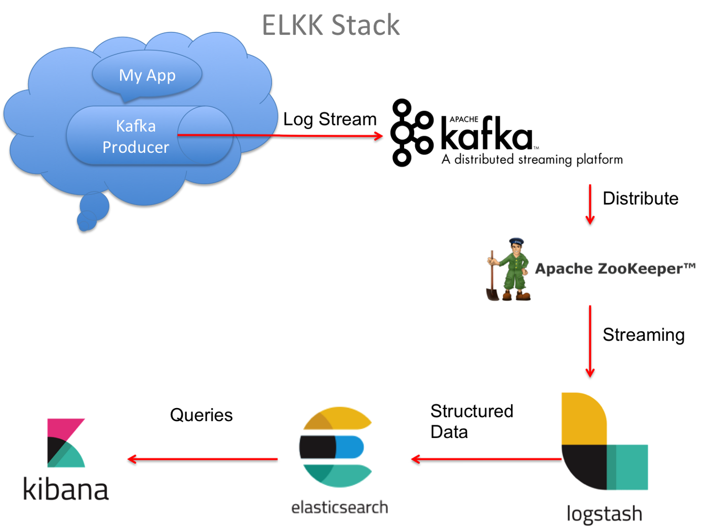]

# System Requirement
* CPUs: 4 Core
* Memory: 6 GB RAM
* Swap: 2 GB.
* Disk image size: 100 GB
* OS: Any OS which support docker installation.


# [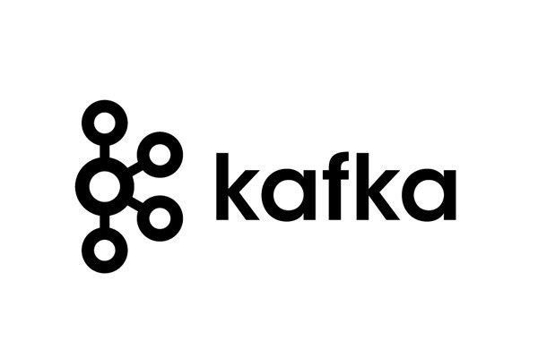]() Kafka & Kafka Manager Docker Configuration

There are two projects with the Docker images for the components that seem to have been trusted the most:

 * [wurstmeister/kafka](https://hub.docker.com/r/wurstmeister/kafka)
 * [spotify/kafka](https://hub.docker.com/r/spotify/kafka)
 
 I have used [Spotify kafka](https://hub.docker.com/r/spotify/kafka).

 ## Why ?
The main hurdle of running Kafka in Docker is that it depends on Zookeeper. Compared to other Kafka docker images, this one runs both Zookeeper and Kafka in the same container. This means:

* No dependency on an external Zookeeper host, or linking to another container
* Zookeeper and Kafka are configured to work together out of the box

In the docker-compose.yml it can be something like this

```yml
services:
  # Kafka Server & Zookeeper Docker Image
  kafkaserver:
    image: "spotify/kafka:latest" 
    container_name: kafka
    # Configures docker image to run in bridge mode network
    hostname: kafkaserver
    networks:
      - kafkanet
    # Make a port available to services outside of Docker
    ports:
      - 2181:2181
      - 9092:9092
    environment:
      ADVERTISED_HOST: kafkaserver
      ADVERTISED_PORT: 9092
```

Note: Update host file as below :
```
127.0.0.1 kafkaserver
```

[Kafka Manager](https://hub.docker.com/r/mzagar/kafka-manager-docke) is a tool from Yahoo Inc. for managing Apache Kafka.

In the  `docker-compose.yml` it can be something like this

```yml
  # Kafka Manager docker image, it is a web based tool for managing Apache Kafka.
  kafka_manager:
    image: "mzagar/kafka-manager-docker:1.3.3.4"
    container_name: kafkamanager
    #configures the kafka manager docker image to run in bridge mode network
    networks:
      - kafkanet
    # Make a port available to services outside of Docker
    ports:
      - 9000:9000
    # It Links kafka_manager container to kafkaserver container to communicate.
    links:
      - kafkaserver:kafkaserver
    environment:
      ZK_HOSTS: "kafkaserver:2181"
```

# []() Elasticserach Docker Configuration

[Elasticsearch](https://hub.docker.com/_/elasticsearch) docker-compose simple configuration in the `docker-compose.yml` something like this

```yml
  # Elasticsearch Docker Image
  elasticsearch:
    image: docker.elastic.co/elasticsearch/elasticsearch:6.4.0
    container_name: elasticsearch
    # Make a port available to services outside of Docker
    ports:
      - 9200:9200
      - 9300:9300
    # Configures docker image to run in bridge mode network
    networks:
      - kafkanet
```

Note: Update host file as below :
```
127.0.0.1 elasticsearch
```
# []() Kibana Docker Configuration

[Kibana](https://hub.docker.com/_/kibana) docker-compose simple configuration in the    `docker-compose.yml`  something like this

```yml
  # Kibana Docker Image
  kibana:
    image: docker.elastic.co/kibana/kibana:6.4.0
    container_name: kibana
    # Make a port available to services outside of Docker
    ports:
      - 5601:5601
    # It Links kibana container & elasticsearch container to communicate
    links:
      - elasticsearch:elasticsearch
    # Configures docker image to run in bridge mode network
    networks:
      - kafkanet
    # You can control the order of service startup and shutdown with the depends_on option.
    depends_on: ['elasticsearch']
```

# []() Logstash Docker Configuration'

[Logstash](https://hub.docker.com/_/logstash) docker-compose simple configuration in the    `docker-compose.yml`  something like this

```yml
  # Logstash Docker Image
  logstash:
    image: docker.elastic.co/logstash/logstash:6.4.0
    container_name: logstash
    # It Links elasticsearch container & kafkaserver container  & logstash container to communicate
    links:
      - elasticsearch:elasticsearch
      - kafkaserver:kafkaserver
    # Configures docker image to run in bridge mode network
    networks:
      - kafkanet
    # You can control the order of service startup and shutdown with the depends_on option.
    depends_on: ['elasticsearch', 'kafkaserver']
    # Mount host volumes into docker containers to supply logstash.config file
    volumes:
      - '/private/config-dir:/usr/share/logstash/pipeline/'
```

Next, we will configure a Logstash pipeline that pulls our logs from a Kafka topic, process these logs and ships them on to Elasticsearch for indexing.

Create `logstash.conf` file in your local system.  (This location must be shared with docker)

## Logstash pipeline configuration

* We are using same kafka cluster to visualize sit & uat enviromet logs.

* Two index will be created with "sit" & "uat" prefix based on kafa topic name.


```json
# Plugin Configuration. This input will read events from a Kafka topic.
# Ref Link - https://www.elastic.co/guide/en/logstash/current/plugins-inputs-kafka.html

input {
    kafka {
            bootstrap_servers => "kafkaserver:9092"
           topics => ["sit.catalogue.item","uat.catalogue.item"]
            auto_offset_reset => "earliest"
            decorate_events => true
    }
}

# Filter Plugin. A filter plugin performs intermediary processing on an event.
# Ref Link - https://www.elastic.co/guide/en/logstash/current/filter-plugins.html

filter {
    json {
        source => "message"
    }
    mutate {
        remove_field => [
            "[message]"
        ]
    }
    if (![latency] or [latency]=="") {
        mutate {
            add_field => {
                latency => -1
            }
        }
    }
    date {
         match => [ "time_stamp", "yyyy-MM-dd'T'HH:mm:ss.SSS'Z'" ]
        timezone => "Europe/London"
        target => [ "app_ts" ]
        remove_field => ["time_stamp"]
    }
    if ([@metadata][kafka][topic] == "uat.catalogue.item") {
        mutate {
            add_field => {
                indexPrefix => "uat-catalogue-item"
            }
        }
    }else if ([@metadata][kafka][topic] == "sit.catalogue.item") {
        mutate {
            add_field => {
                indexPrefix => "sit-catalogue-item"
            }
        }
    }else{
         mutate {
            add_field => {
                indexPrefix => "unknown"
            }
        }
    }
}

#An output plugin sends event data to a particular destination. Outputs are the final stage in the event pipeline.
# Ref Link - https://www.elastic.co/guide/en/logstash/current/output-plugins.html


output {
   elasticsearch {
      hosts => ["elasticsearch:9200"]
      index => "%{[indexPrefix]}-logs-%{+YYYY.MM.dd}"
    }
}
```
Below is detailed explanation of logstash.conf file

* <b> decorate_events </b>: Metadata is only added to the event if the decorate_events option is set to true (it defaults to false).

    Please note that @metadata fields are not part of any of your events at output time. If you need these information to be inserted into your original event, you’ll have to use the mutate filter to manually copy the required fields into your event.
    ```
        decorate_events => true
    ```


* <b>mutate</b> : The mutate filter allows you to perform general mutations on fields. You can rename, remove, replace, and modify fields in your events. Below is example of mutation on json field `latency`.
If the latency is not provided from the source application we can set it to default  `-1`
    ```
        if (![latency] or [latency]=="") {
        mutate {
            add_field => {
                latency => -1
            }
        }
    }
    ```
* <b> remove_field => `message`</b> : Logstash output produces  `message` field. Storing this raw `message` field to elasticsearch is only adding unused or redundant data. so we can remove `message` field using  below filter

    ```
        mutate {
        remove_field => [
            "[message]"
        ]
    }
    ```

*  <b>Date Filter plugin </b> : The date filter is used for parsing dates from fields, and then using that date or timestamp as the logstash timestamp for the event.In below example we are using `time_stamp` field from JSON (which is in UTC time formate provided by source application) & converting it to `"Europe/London"` timezone.

    ```
    date {
            match => [ "time_stamp", "yyyy-MM-dd'T'HH:mm:ss.SSS'Z'" ]
            timezone => "Europe/London"
            target => [ "app_ts" ]
            remove_field => ["time_stamp"]
        }

    ```
* <b>index-prefix field</b> : We are creating index prefix `"uat-catalogue-item"` & `"sit-catalogue-item"` based on the metadata info provided by kaka broker. As creating multiple cluster for POC will be bit heavier. so we are using same cluser to demonstrat two enviroment.
we  are using below meta field  to identify kafka topic for diffrent enviroment.

    `[@metadata][kafka][topic]` : original Kafka topic name from where the message was consumed.

    ```
        //If message consumed from uat kafka topic add prefix "uat-catalogue-item"
        if ([@metadata][kafka][topic] == "uat.catalogue.item") {
            mutate {
                add_field => {
                    indexPrefix => "uat-catalogue-item"
                }
            }
        }
        //If message consumed from sit kafka topic add prefix "sit-catalogue-item"
        else if ([@metadata][kafka][topic] == "sit.catalogue.item") {
            mutate {
                add_field => {
                    indexPrefix => "sit-catalogue-item"
                }
            }
        }
        //If message consumed from any other kafka topic add index prefix "unknown"
        else{
            mutate {
                add_field => {
                    indexPrefix => "unknown"
                }
            }
        }
    ```


## Note: Update the `volumes :` value in `docker-compose.yml` file as below :

```
    volumes:
      - 'LOCATION_OF_LOG_STASH_CONF_FILE:/usr/share/logstash/pipeline/'
```

## MAC/Linux OS

```
    volumes
        - '/private/config-dir:/usr/share/logstash/pipeline/'
```

## WINDOWS

```
    volumes
        - '//C/Users/config-dir:/usr/share/logstash/pipeline/'
```

# [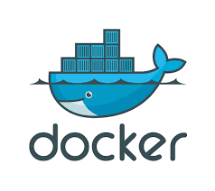]() Docker Network

Docker networking utilizes already existing Linux Kernel Networking features like (iptables, namespaces, bridges etc.).
With Docker Networking, we can connect various docker images running on same host or across multiple hosts.
By default, three network modes are active in Docker.

1. Bridge
2. Host
3. Null

Bridge Network driver provides single host networking capabilities. By default containers connect to Bridge Network. Whenever container starts, it is provided an internal IP address. All the containers connected to the internal bridge can now communicate with one another. But they can’t communicate outside the bridge network.

```yml
# Use bridge network for all the container, keeping all the container in same network will simplify the communication between the container.
networks: 
  kafkanet:
    driver: bridge
```

# Now put all component togather in one `docker-compose.yml` file & it will be look like this

```yml
version: "2"
services:
  # Kafka Server & Zookeeper Docker Image
  kafkaserver:
    image: "spotify/kafka:latest" 
    container_name: kafka
    # Configures docker image to run in bridge mode network
    hostname: kafkaserver
    networks:
      - kafkanet
    # Make a port available to services outside of Docker
    ports:
      - 2181:2181
      - 9092:9092
    environment:
      ADVERTISED_HOST: kafkaserver
      ADVERTISED_PORT: 9092
  
  # Kafka Manager docker image, it is a web based tool for managing Apache Kafka.
  kafka_manager:
    image: "mzagar/kafka-manager-docker:1.3.3.4"
    container_name: kafkamanager
    #configures the kafka manager docker image to run in bridge mode network
    networks:
      - kafkanet
    # Make a port available to services outside of Docker
    ports:
      - 9000:9000
    # It Links kafka_manager container to kafkaserver container to communicate.
    links:
      - kafkaserver:kafkaserver
    environment:
      ZK_HOSTS: "kafkaserver:2181"
  
  # Elasticsearch Docker Image
  elasticsearch:
    image: docker.elastic.co/elasticsearch/elasticsearch:6.4.0
    container_name: elasticsearch
    # Make a port available to services outside of Docker
    ports:
      - 9200:9200
      - 9300:9300
    # Configures docker image to run in bridge mode network
    networks:
      - kafkanet
  
  # Kibana Docker Image
  kibana:
    image: docker.elastic.co/kibana/kibana:6.4.0
    container_name: kibana
    # Make a port available to services outside of Docker
    ports:
      - 5601:5601
    # It Links kibana container & elasticsearch container to communicate
    links:
      - elasticsearch:elasticsearch
    # Configures docker image to run in bridge mode network
    networks:
      - kafkanet
    # You can control the order of service startup and shutdown with the depends_on option.
    depends_on: ['elasticsearch']
  
  # Logstash Docker Image
  logstash:
    image: docker.elastic.co/logstash/logstash:6.4.0
    container_name: logstash
    # It Links elasticsearch container & kafkaserver container  & logstash container to communicate
    links:
      - elasticsearch:elasticsearch
      - kafkaserver:kafkaserver
    # Configures docker image to run in bridge mode network
    networks:
      - kafkanet
    # You can control the order of service startup and shutdown with the depends_on option.
    depends_on: ['elasticsearch', 'kafkaserver']
    # Mount host volumes into docker containers to supply logstash.config file
    volumes:
      - '/private/config-dir:/usr/share/logstash/pipeline/'

# Use bridge network for all the container, keeping all the container in same network will simplify the communication between the container.
networks: 
  kafkanet:
    driver: bridge

```

# Starting the environment

Once the docker-compose.yml file is ready, open your favorite terminal in the folder which contains it and run:

```
$ docker-compose up
```

You should see output similar to this one:

[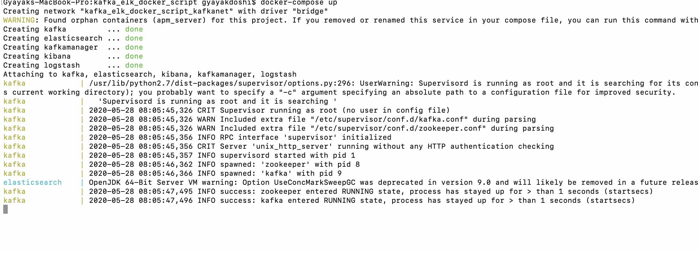](image.png) 

Open  new terminal window & check status of the containers by invoking:

```
$ docker-compose ps
```

You should see output similar to this one:

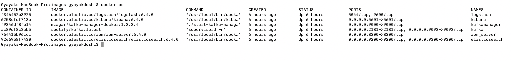

# Let’s ping  Elasticsearch conatiner, by opening

```
http://localhost:9200/
```
in the browser:

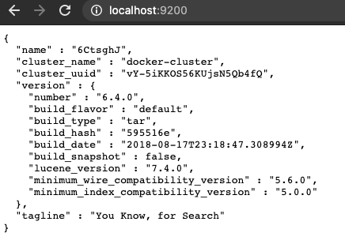


# Let’s Open  Kibana , by opening

```
http://localhost:5601/
```
in the browser:


[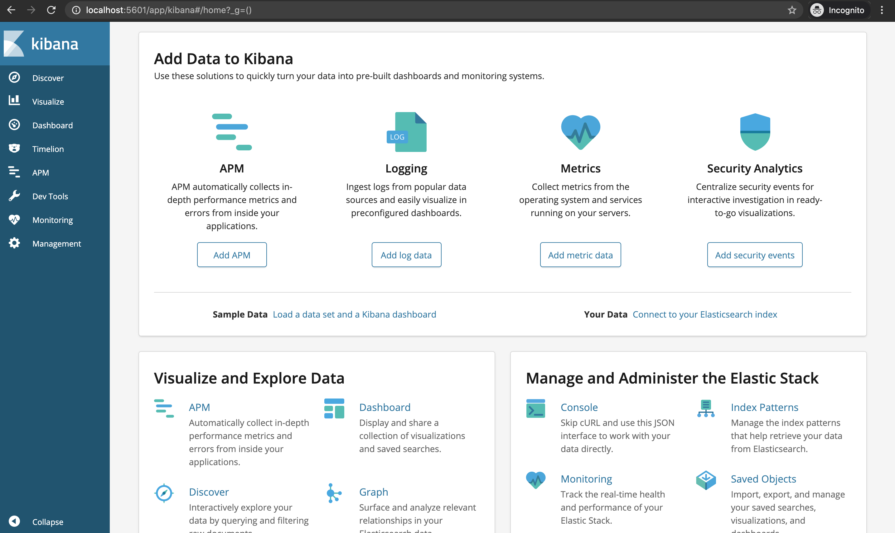](image.png) 

# Let’s launch Kafka-Manager, by opening

```
http://localhost:9000
```
## in the browser:

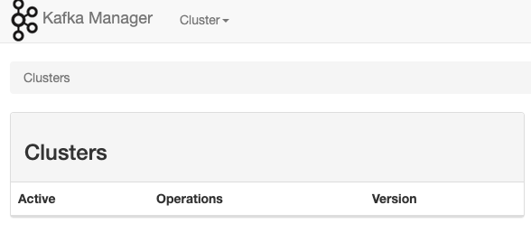

## Click on Cluster & `Add cluster`:

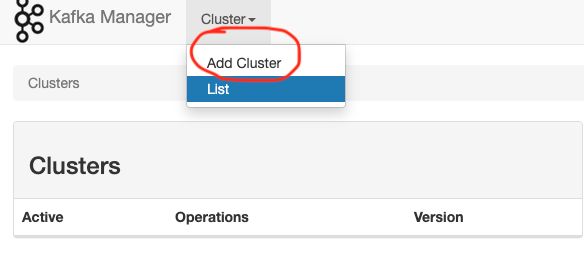

## Provide below details & click on `Save`:

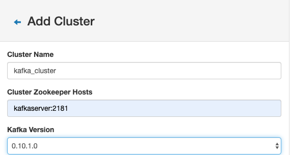


## Click on `Go to cluster view` :

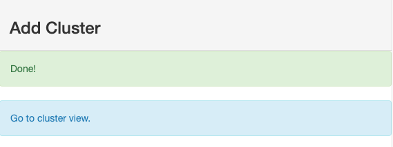

## Click on `kafka_cluster`:


## Click on `Topic` to `Create` topic

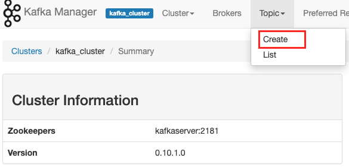

## Create topic `sit.catalogue.item`

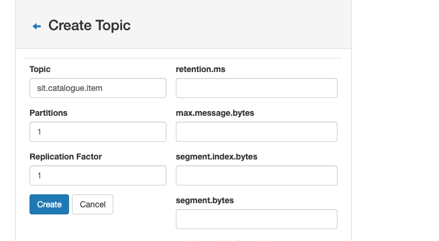

## Create topic `uat.catalogue.item`

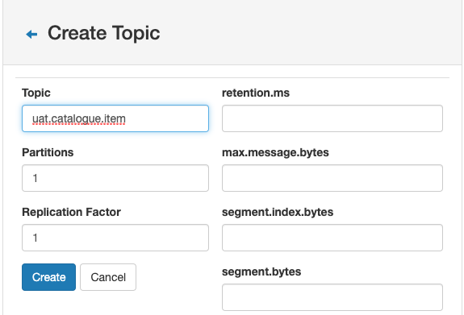


# Produce `JSON` message to kafka topic `sit.catalogue.item` & `uat.catalogue.item`

## JSON message 

```json
{
 # Application Name  
"app":"catalogue-item",

# Client Request Id
"crid":"1BFXCD",

#Unique Id
"uuid":"ec25cdc8-a336-11ea-bb37-0242ac130002",

# Message
"msg": {"app":"catalogue-item","crid":"1BFXCD","uuid":"ec25cdc8-a336-11ea-bb37-0242ac130002","msg":"Create Catlogue PayLoad - {'sku':'CTLG-123-0001','name':'The Avengers','description':'Marvel's The Avengers Movie','category':'Movies','price':0,'inventory':0}","status":"SUCCESS","latency":"1","source":"Postman API Client","destination":"Catalogue DataBase","time_stamp":"2020-05-31T13:22:10.120Z"}
,

# Status Code - SUCCESS,ERROR,WARN,INFO
"status":"SUCCESS",

# Time that passes between a user action and the resulting response
"latency":"1",

# Sorce of message
"source":"Postman API Client",

# Destination of message
"destination":"Catalogur Database",

# Application Time Stamp
"time_stamp":"2020-05-31T13:22:10.120Z"
}
```

## Run Kafka Producer Console
```
$ ./kafka-console-producer.sh --broker-list kafkaserver:9092 --topic sit.catalogue.item
```

```json
## Message published to `uat.catalogue.item` kafka topic

#SUCCESS

{"app":"catalogue-item","crid":"1BFXCD","uuid":"ec25cdc8-a336-11ea-bb37-0242ac130002","msg":"Create Catlogue PayLoad - {'sku':'CTLG-123-0001','name':'The Avengers','description':'Marvel's The Avengers Movie','category':'Movies','price':0,'inventory':0}","status":"SUCCESS","latency":"1","source":"Postman API Client","destination":"Catalogue DataBase","time_stamp":"2020-05-31T13:22:10.120Z"}

## ERROR

{"app":"catalogue-item","crid":"1BFXCD","uuid":"ec25cdc8-a336-11ea-bb37-0242ac130002","msg":"Create Catlogue PayLoad - {'sku':'CTLG-123-0001','name':'The Avengers','description':'Marvel's The Avengers Movie','category':'Movies','price':0,'inventory':0}","status":"ERROR","latency":"1","source":"Postman API Client","destination":"Catalogue DataBase","time_stamp":"2020-05-31T13:22:10.120Z"}

## WARN
{"app":"catalogue-item","crid":"1BFXCD","uuid":"ec25cdc8-a336-11ea-bb37-0242ac130002","msg":"Create Catlogue PayLoad - {'sku':'CTLG-123-0001','name':'The Avengers','description':'Marvel's The Avengers Movie','category':'Movies','price':0,'inventory':0}","status":"WARN","latency":"1","source":"Postman API Client","destination":"Catalogue DataBase","time_stamp":"2020-05-31T13:22:10.120Z"}
```
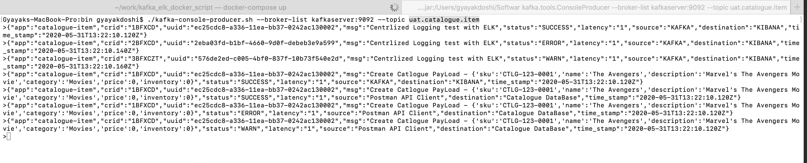


# Create Index in Kibana

## Open Kibana using below URL

```
http://localhost:5601/
```

* Click `Management` on side navigation bar.
* Click on `Index Patterns`

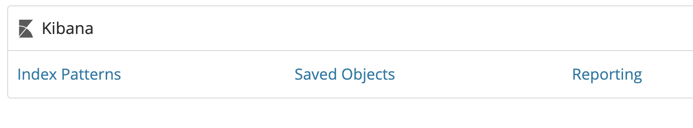

* It will navigate to blow Screen

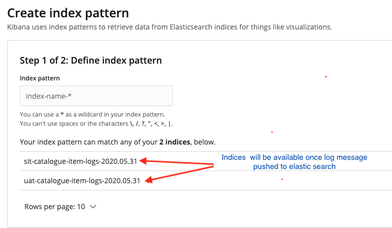

* Create index pattern for `sit` logs

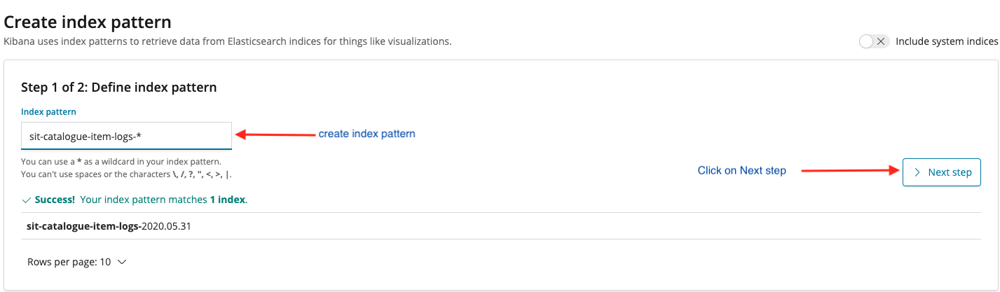

* Configure Settings

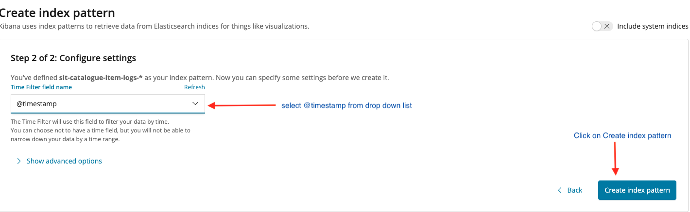

* If Index created sucessfully will navigate to blow screen

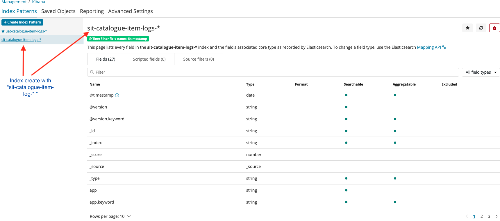

* Click `Discover` on side navigation bar

*  Logs avaibale in kibana with the index created

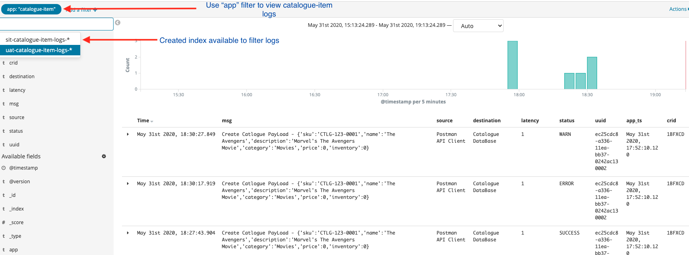

* Visualize Messgae in tabular format

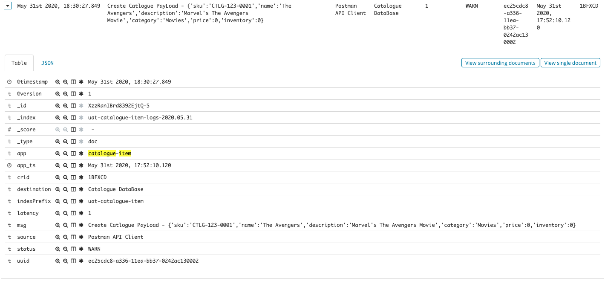

# Conclusion
If you had made up to this point :- congratulations ! You have successfully dockerized the ELK stack with Kafka.

# Some useful commands


## Docker Commands
```
    # Builds, (re)creates, starts, and attaches to containers for a service
     $ docker-compose up
    
    # Stops containers and removes containers, networks, volumes, and images created by up
     $ docker-compose down
    
    # Lists all running containers in docker engine
     $ docker ps
    
    # List docker images
     $ docker images ls

    # List all docker networks
     $ docker network ls
```
## Kafka Commands

## Producers

You can produce messages from standard input as follows:

```
$ ./kafka-console-producer.sh --broker-list kafkaserver:9092 --topic uat.catalogue.item
```

## Consumers

You can begin a consumer from the beginning of the log as follows:

```
$ ./kafka-console-consumer.sh --bootstrap-server kafkaserver:9092 --topic uat.catalogue.item --from-beginning
```

You can consume a single message as follows:

```
$ ./kafka-console-consumer.sh --bootstrap-server kafkaserver:9092 --topic uat.catalogue.item  --max-messages 1
```

You can consume a single message from `__consumer_offsets` as follows:


You can consume and specify a consumer group as follows:

```
$ ./kafka-console-consumer.sh --topic uat.catalogue.item --new-consumer --bootstrap-server kafkaserver:9092 --consumer-property group.id=elk-group
```

# Ref Links
https://www.elastic.co/guide/en/logstash/current/plugins-inputs-kafka.html

https://medium.com/@caysever/docker-compose-network-b86e424fad82

https://zablo.net/blog/post/setup-apache-kafka-in-docker-on-windows/

https://medium.com/@marcelo.hossomi/running-kafka-in-docker-machine-64d1501d6f0b


https://www.elastic.co/guide/en/logstash/current/output-plugins.html

https://www.elastic.co/guide/en/logstash/current/output-plugins.html

https://www.elastic.co/guide/en/logstash/current/filter-plugins.html

 https://www.elastic.co/guide/en/logstash/current/plugins-inputs-kafka.html

 https://github.com/lensesio/kafka-cheat-sheet/blob/master/README.md

 https://www.elastic.co/guide/en/logstash/current/plugins-filters-mutate.html
